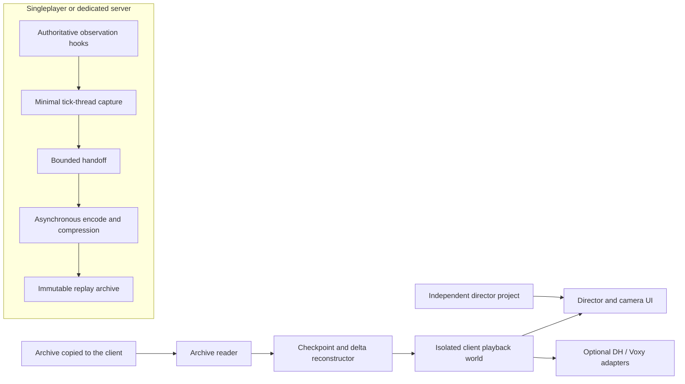

# DreamingRecall MVP Architecture

Status: accepted design baseline, recording/archive prototype in progress  
Target: Minecraft 1.21.1 on NeoForge

## Objective

DreamingRecall records one Minecraft server process as a unified, randomly accessible timeline and plays it inside an isolated client-side environment. A dedicated server and a singleplayer integrated server share the same archive, playback and director model.

The product is server-global rather than player-recorder based: world state is captured once from the authoritative server, while per-player chat and optional client camera samples are subordinate tracks on the same timeline.

## Guarantee Boundary

The design establishes mechanisms and measurable acceptance targets. It does not claim that those targets have already been proven before a NeoForge prototype and representative modpack benchmarks exist.

| Goal | Structural guarantee | Evidence required before release |
|---|---|---|
| Low recording impact | No persistence or compression wait on the tick thread, bounded handoff, server-first overload policy | 20-player A/B workload meets p95 and p99 MSPT budgets |
| Smooth playback | Spatial working set, deduplicated checkpoints, cancellable seeks and asynchronous decode | Two-hour archive, continuous playback and 10,000 random seeks |
| Modpack portability | Portable core state, stable resource IDs, placeholders and optional enhancement tracks | Missing-mod, changed-version and corrupt-extension compatibility matrix |
| Multiplayer-native behavior | One authoritative global timeline for every dimension and player | Multi-player, multi-dimension and reconnect test scenarios |

DreamingRecall can contain failures inside its own codecs, objects and extension boundaries. It cannot guarantee recovery from every global Mixin conflict, native library fault, JVM failure or graphics driver crash.

## Scope

MVP includes:

- Singleplayer and dedicated-server recording as equal use cases.
- All dimensions in one Minecraft server process.
- Every player, global observable state and every chunk while fully observed.
- Local playback from an archive copied by an administrator through an existing file channel (SSH, SFTP, panel or equivalent).
- Director controls, free camera, player attachment, first person, markers and camera keyframes.
- Graceful playback when the mod list or mod versions change.

MVP excludes:

- Cross-Minecraft-version playback.
- A unified timeline across Velocity, BungeeCord or multiple server processes.
- Server backup, rollback or deterministic re-execution of mod logic.
- Arbitrary mod databases, task queues, caches and unknown custom packet capture.
- Player voice, screen pixels and GUI reconstruction.
- Continuous negative-speed playback, a complex curve editor and built-in video export.
- Security beyond basic administrator authorization in the first usable version.

## Runtime Architecture

The live dedicated server never hosts the replay world and does not expose a replay transport protocol. An administrator copies the immutable archive out of the server by an existing file-management channel and places it under the client's `dreamingrecall/replays` directory. Singleplayer uses the same archive reader through a local data source.

## Recording Pipeline

1. Recording is disabled after installation. A singleplayer user starts it explicitly; a dedicated-server administrator starts it or configures automatic recording.
2. Dedicated-server recording announces itself to online players by default. Administrators can disable that notice.
3. Starting on a live world does not pause the server. The recorder builds consistent baselines incrementally and reconciles changes that occur during capture.
4. A chunk enters a reliable observation interval only after its complete baseline exists. Never-loaded areas remain outside archive coverage.
5. Records carry both monotonic elapsed archive time and authoritative server tick identity.
6. The tick thread performs only the minimum safe state extraction and enqueues bounded immutable capture data. Encoding, compression, checksums and disk writes happen asynchronously.
7. The archive forms a durable committed segment at most every 10 seconds by default. Graceful shutdown drains the queue; a crash discards only the incomplete tail.
8. If the pipeline falls behind, optional enhancement data is shed first. If core state still cannot keep up, the recorder marks a gap and later resumes from a new complete boundary instead of blocking ticks or growing memory without limit.

Captured core information includes the portable visual and audible state needed by playback: world and dimension state, observed chunks, block and sky light, entities, players, ordinary game sounds and standard chat entries delivered to each player. Exact core field coverage is finalized by the format prototype, but it must obey the observable-state boundary.

Optional client camera samples improve first-person accuracy. They are disabled by default on multiplayer clients and can be enabled by the player or server policy. Singleplayer supplies the camera track locally. Camera samples never contain screen pixels or GUI state.

## Archive Model

The following is a logical layout, not a commitment to final filenames:

| Area | Responsibility |
|---|---|
| Manifest | Archive identity, Minecraft version, format version, duration, dimensions and diagnostics |
| Portable registries | Stable resource IDs, block properties and generic descriptors needed for degradation |
| Content store | Deduplicated chunk sections, state baselines and other immutable payloads addressed by content identity |
| Timeline segments | Ordered state increments and transient events with archive time and tick identity |
| Checkpoints and indexes | Spatial and temporal references used for bounded random access |
| Core tracks | Global state, players, entities, delivered chat, game sound and observation intervals |
| Optional tracks | Client camera data and versioned mod extensions |
| Resource attachments | Content-addressed server resource packs within configured limits |
| Integrity data | Per-segment checksums, completion markers and repair metadata |

Committed segments solve durability. State checkpoints solve seeking. They are independent: a 10-second durability boundary does not imply a complete state snapshot every 10 seconds.

The initial checkpoint target is roughly 30 seconds, adjusted by local change volume and measured seek latency. Unchanged spatial content is referenced rather than duplicated. The final compression codec, checkpoint cadence, buffer size and physical container layout are benchmark-selected implementation details.

## Terrain And Random Access

- On first full observation, a chunk receives a complete portable baseline.
- While loaded, its observable changes and authoritative light changes enter the timeline.
- After unload, precise playback may retain the last known terrain but marks the interval unobserved and does not invent entity activity.
- On reload, a new authoritative baseline reconciles the next observation interval.
- Playback never runs a current world generator or mod simulation to guess missing history.
- A seek restores global state and the camera's spatial working set, not every recorded object in every dimension.

Distant Horizons and Voxy are optional playback adapters. Their databases are disposable derivatives, isolated by archive and dimension. Within one archive, distant terrain remains continuous across seeks and may show a later or final known landscape. Near vanilla chunks remain time-accurate and replace LOD geometry as the camera approaches. Different archives or live-world caches are never mixed.

## Playback And Seeking

Playback runs in an isolated client world and never modifies the source server or singleplayer save.

When the user grabs the timeline cursor:

1. Automatic time progression pauses.
2. Older in-flight seek work is cancelled when the target changes.
3. A spatial index chooses the nearest useful checkpoint.
4. The current camera working set is restored and relevant increments are applied.
5. Dragging targets a real 3D preview at roughly 10 to 15 updates per second and may defer non-critical transient effects.
6. Releasing the cursor produces an exact state, then resumes the previous transport state from that point.

The target is a first preview in roughly 100 ms, a typical exact landing within 500 ms and a pressure-case landing within roughly one second. Archive duration must not make seek cost grow linearly.

Source-server lag remains part of archive time, while rendering and camera movement remain independent and smooth. Sounds, particles and other transient events fire only when normal forward playback crosses their timestamps; a seek does not emit the skipped backlog. MVP supports backward seeking and scrubbing, but not continuous reverse playback.

## Compatibility Model

Compatibility uses layered fidelity:

1. **Portable core**: stable resource IDs, block properties, generic transforms, bounding boxes, equipment and other renderer-independent observable state.
2. **Native enhancement**: protocol-fingerprinted payloads used only when a compatible local codec exists.
3. **Extension tracks**: optional, versioned mod integrations with stable IDs, size limits and explicit fallback behavior.
4. **Resource attachments**: server resource packs that improve visual, font and sound fidelity without carrying mod code.
5. **Placeholders**: unknown blocks, entities and items retain their original identity and generic representation; non-critical effects can be skipped with diagnostics.

The Minecraft version must match. The mod list and mod versions do not. A compatible local mod supplies its normal models, textures, sounds and renderers. A missing or incompatible mod degrades only the affected content.

Unknown custom network payloads are never archived wholesale. Extension callbacks and decoders run behind DreamingRecall-controlled fault boundaries. Repeated extension failures disable that extension only for the current playback session; reopening the archive retries it. Corrupt indexes can be rebuilt from valid segments, and isolated corrupt content becomes a placeholder or explicit gap.

## Director MVP

The director experience contains:

- Play, pause, seek and positive playback-speed control.
- Free camera without collision.
- Player list, attachment and first-person view.
- Server-reconstructed first person for every player, enhanced by an optional client camera track when available.
- Timeline markers.
- Position, yaw, pitch, roll and FOV keyframes.
- Linear and smooth interpolation, keyframe dragging and path preview.
- Hard cuts between dimensions; camera paths never interpolate through dimension boundaries.
- Independent director projects with autosavable edits, leaving source archives immutable.

A director project can hold keyframes, markers, playback ranges and speed choices. Multiple projects can reference the same archive. Complex curve editing and video export are deferred.

## Chat, Identity And Resources

The archive records every standard chat-box entry actually delivered to each player, including public chat, private messages, team messages, system notices and command feedback. Content can be deduplicated with a recipient set. It does not record unsent input text, the server console or unknown custom UI payloads.

Player UUIDs, names and skin identity are retained for replay identity and rendering. IP addresses, authentication tokens and other connection secrets are excluded. Player voice remains excluded from MVP.

Server resource packs are optional archive attachments keyed by content hash and applied only inside the isolated playback. Mod JARs and complete extracted mod assets are never bundled.

## Operations And Retention

- Archive files remain on the server until an administrator manually copies them to a client. DreamingRecall does not implement a remote replay transport in the first version.
- The first version does not add encryption, fine-grained ACLs, redaction or ordinary-player sharing.
- A server restart closes the current logical replay session. The next process start creates another archive.
- Long logical sessions can span multiple physical files without appearing split in the UI.
- Manual recordings are never deleted by automatic rotation.
- Automatic recording cannot operate without a configured quota. It evicts the oldest unprotected automatic archive and stops consuming space before free disk falls below 10 GB or 10%.
- Director projects remain separate from retention-managed source archives and must report a missing source rather than silently attaching to a different archive.

## Performance And Reliability Gates

| Area | MVP target |
|---|---|
| Recording tick cost | p95 additional MSPT at or below 1 ms; p99 at or below 3 ms |
| Tick-thread persistence wait | Zero |
| Playback CPU frame cost | p95 increase at or below roughly 2 ms versus the same scene in normal spectator mode |
| Scrub preview | First visible result around 100 ms; 10 to 15 preview states per second |
| Exact seek | Usually within 500 ms; pressure case around one second |
| Crash recovery | Graceful shutdown loses nothing observed; abrupt termination loses at most about 10 seconds by default |
| Stability stress | Two-hour, approximately 20-player archive; continuous playback and at least 10,000 random seeks without an unhandled DreamingRecall failure |
| Memory | Bounded by configured buffers and the current playback working set, not total archive duration |

The reference workload must include players spread across dimensions, exploration, chunk churn, entity activity, a representative large modpack, missing-mod playback, version-changed mods, injected extension exceptions, corrupt segments and slow disks. Results must publish hardware, JVM, modpack and configuration; a fixed FPS is not promised across arbitrary shaders, LOD settings and GPUs.

## Format Evolution And Licensing

Archive format versions are independent of DreamingRecall releases. Within the same Minecraft version, newer readers must open older formats through compatibility readers or non-mutating migration views. Unknown optional tracks are retained or skipped. Older readers may explicitly reject an unsupported newer major format.

DreamingRecall uses LGPL-3.0-or-later and publishes its archive format. Implementation remains clean-room relative to Flashback and ReplayMod: Flashback's all-rights-reserved source and ReplayMod's GPL source are not copied. Compatible MIT or LGPL code can be reused only with its required notices and license obligations.

## Implementation Order

1. Prove state capture and the portable registry model on NeoForge 1.21.1.
2. Build the append-only archive, integrity recovery, content store and random-access index.
3. Benchmark recording under scripted 20-player load before expanding the captured surface.
4. Build local isolated playback, working-set reconstruction and random seeking.
5. Add the director UI, camera tracks and independent project files.
6. Add extension boundaries, placeholders, resource attachments and DH/Voxy adapters.
7. Run corruption, missing-mod, long-duration and repeated-seek stress suites before claiming the performance and stability guarantees.

## Prototype-Selected Details

The following no longer require product decisions, but must be selected from benchmark evidence:

- Compression codec and level.
- Exact checkpoint cadence and spatial granularity.
- Recorder queue memory limits and background worker counts.
- Resource attachment size cap.
- Repeated-extension-error threshold.
- LOD cache prewarming and cleanup policy.
